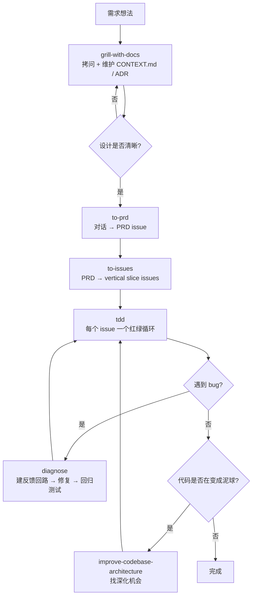
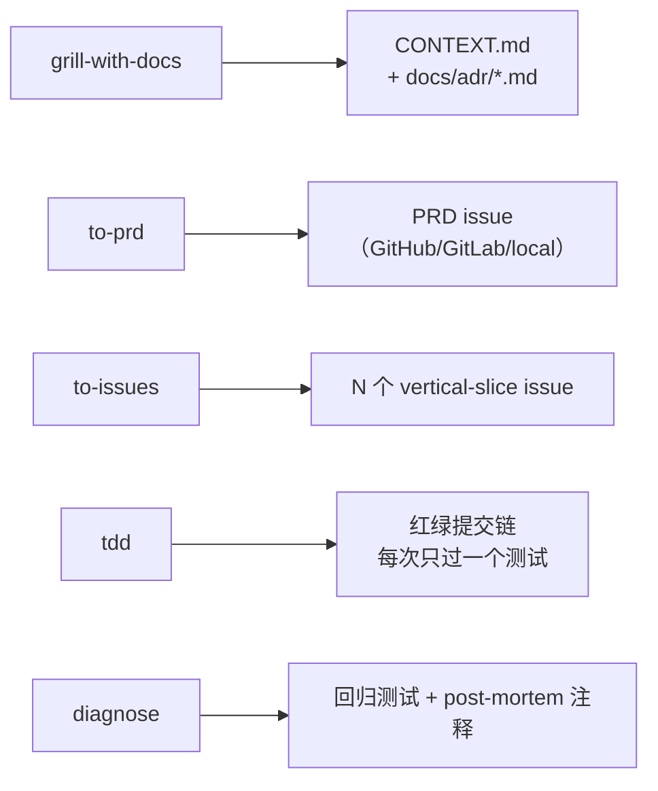
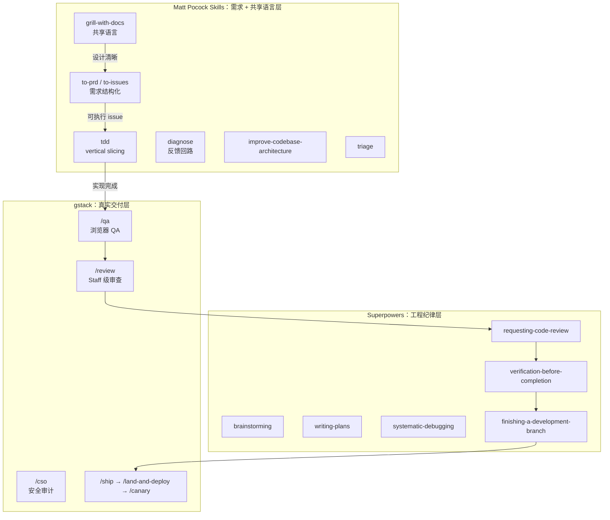
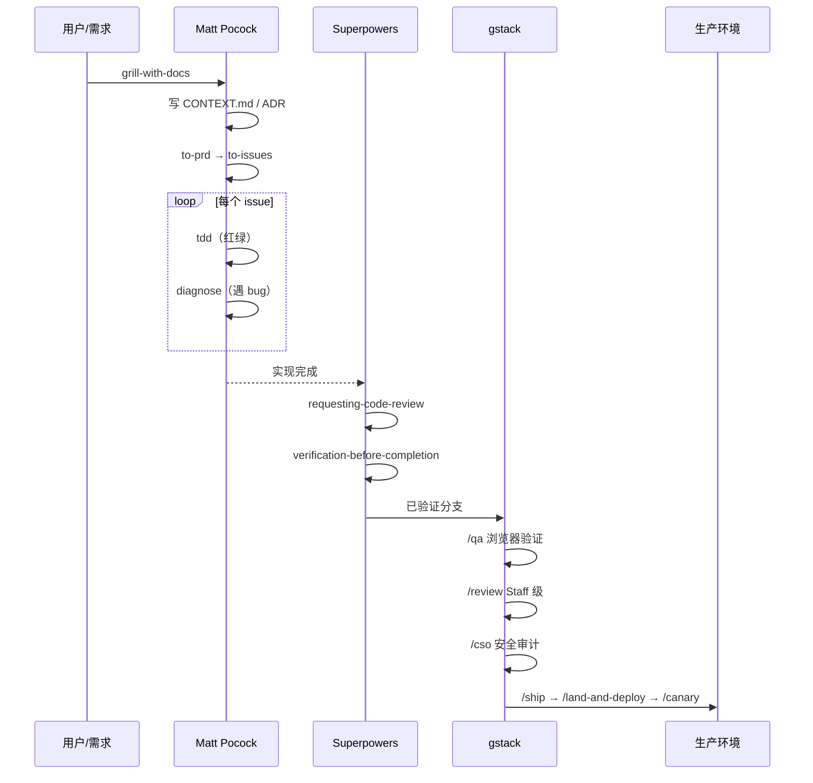

# Matt Pocock Skills 项目实战使用指南

> [!summary] 核心结论
> Matt Pocock Skills 的核心价值不是给 AI 一堆指令，而是用「拷问 + 共享语言」逼着 AI 在写代码前真正理解你想做什么。
>
> 它解决的问题是：AI 总是猜测、跑题、用 20 个词描述本可以用 1 个词的概念，导致每个会话都从零开始解释项目。

## 0. 阅读导航

> [!tip] 怎么读这篇
> - 想快速理解：先看 [[#2. 它解决的 4 个失败模式]] 和 [[#20. 最终总结]]。
> - 想落地项目：重点看 [[#5. 标准 5 阶段闭环]] 和 [[#7. setup-matt-pocock-skills 一次性配置]]。
> - 想和 Superpowers / gstack 搭配：直接看 [[#16. 与 Superpowers 和 gstack 的配合边界]]。

| 你想解决的问题 | 推荐阅读 |
| --- | --- |
| AI 没听懂我要的需求 | [[#8. 阶段一：Grill-with-docs 拷问 + 共享语言]] |
| AI 用词混乱 / 每次都要重新解释 | [[#3. 杀手锏：CONTEXT.md 共享语言]] |
| 想把对话变成 PRD 或 issue | [[#10. 阶段三：to-prd 与 to-issues]] |
| 想规范 TDD | [[#11. 阶段四：tdd]] |
| 想规范 Debug | [[#12. 阶段五：diagnose]] |
| 代码越写越烂、想救救它 | [[#13. improve-codebase-architecture]] |
| 我有 issue 但不知道怎么排 | [[#14. triage]] |
| 想写自己的 skill | [[#15. write-a-skill]] |

## 0.1 一页速览

| 模块 | Skill | 项目作用 |
| --- | --- | --- |
| 一次性配置 | `setup-matt-pocock-skills` | 配置 issue tracker、triage 标签、领域文档布局 |
| 需求拷问 | `grill-me` / `grill-with-docs` | 写代码前把每一个分支都问清楚 |
| 转 PRD | `to-prd` | 把对话浓缩成一篇 PRD，提交到 issue tracker |
| 拆 issue | `to-issues` | 把 PRD 拆成可被独立认领的 vertical slice |
| 编码 | `tdd` | 红绿重构，但只允许 vertical slicing |
| 调试 | `diagnose` | 6 个阶段，重点是「先建反馈回路」 |
| 架构改进 | `improve-codebase-architecture` | 找深化模块的机会 |
| 看大局 | `zoom-out` | 让 agent 跳出当前文件看整体 |
| 排查 | `triage` | 用状态机标签处理 issue 流入 |
| 缩 token | `caveman` | 山顶洞人模式，省 75% token |
| 元 | `write-a-skill` | 写新 skill |

> [!check] 最小实践闭环
> `/setup-matt-pocock-skills`（一次性）→ `/grill-with-docs` → `/to-prd` → `/to-issues` → `/tdd`（执行每个 issue）→ `/diagnose`（遇到 bug 时）

## 1. Matt Pocock Skills 是什么

Matt Pocock Skills 是一组**面向 Claude Code 的小而组合的 skills 集合**，作者 Matt Pocock 是 TypeScript 社区知名教育者（Total TypeScript）。

它和 BMAD、Spec-Kit 这种「全流程框架」不同：

- **不接管整个流程** — 你随时可以只用其中一两个 skill。
- **token 经济** — 主 SKILL.md 保持精炼，详细内容用 progressive disclosure 拆出去。
- **模型无关** — 不绑定 Claude，任何会读 markdown 的 agent 都能用。
- **强调工程基本功** — TDD、领域语言、ADR、深模块这些不会过时的东西。

可以把它理解为：

> [!quote] 定位
> AI 编程过程中的「需求 + 领域语言 + 工程基本功」加固层。

它关注的不是「你做什么产品」，而是「在写一行代码之前，AI 是不是真的听懂了你」。

## 2. 它解决的 4 个失败模式

整个 skills 集合是围绕作者总结的 4 个 AI 编程失败模式设计的。

### 2.1 #1 Agent 没做我想要的

> [!quote]
> "No-one knows exactly what they want." — David Thomas & Andrew Hunt

**问题**：你以为 agent 听懂了，结果它做出来的东西完全不是你想的。

**药方**：拷问会话（grilling session）。

| Skill | 用途 |
| --- | --- |
| `grill-me` | 通用，适合非编码场景 |
| `grill-with-docs` | 加强版，同时维护 `CONTEXT.md` 和 ADR |

> [!warning] 最容易踩的坑
> 想到一个功能就直接 "implement X for me"。这种说法在 90% 的情况下都是错的，因为你自己都没想清楚 X 的边界。先 grill。

### 2.2 #2 Agent 太啰嗦

> [!quote]
> "With a ubiquitous language, conversations among developers and expressions of the code are all derived from the same domain model." — Eric Evans, DDD

**问题**：agent 没有项目术语，所以用 20 个词形容本来 1 个词能说清的概念。

**药方**：项目根目录维护一份 `CONTEXT.md`，定义共享语言。

例：
- ❌ "把课程里的章节里的某节课变成 'real'（即在文件系统里给它分配位置）的时候有个 bug"
- ✅ "materialization cascade 有个 bug"

`CONTEXT.md` 让后续每个会话都不用重新解释。这是这个仓库**最值钱的技巧**。

### 2.3 #3 代码不工作

> [!quote]
> "Always take small, deliberate steps. The rate of feedback is your speed limit." — David Thomas & Andrew Hunt

**问题**：方向对了，但 agent 写出来的代码还是跑不通。

**药方**：反馈回路。
- 类型检查（不用 skill 也得有）
- 浏览器访问（建议交给 gstack `/qa`）
- 自动化测试 → `/tdd`
- 调试 → `/diagnose`

`/diagnose` 的 Phase 1 写得很狠：「**这就是 skill 本身**。后面五个阶段都是机械动作。如果你没有快速、确定、agent 可跑的 pass/fail 信号，看再多代码也没用。」

### 2.4 #4 我们造了个泥球

> [!quote]
> "Invest in the design of the system every day." — Kent Beck
> "The best modules are deep." — John Ousterhout, A Philosophy of Software Design

**问题**：AI 写代码快，所以 ball-of-mud 也来得更快。

**药方**：每天花一点时间关注设计。

| Skill | 用途 |
| --- | --- |
| `to-prd` | 写 PRD 时先逼你想清楚动了哪些模块 |
| `zoom-out` | 让 agent 跳出当前文件，从系统层面解释 |
| `improve-codebase-architecture` | 周期性运行，找深化模块的机会 |

## 3. 杀手锏：CONTEXT.md 共享语言

如果你只能从这套 skills 里挑一个东西用，挑 `CONTEXT.md`。

### 3.1 它长什么样

仓库自身的 `CONTEXT.md` 就是一个例子：

```markdown
# Matt Pocock Skills

A collection of agent skills loaded by Claude Code.

## Language

**Issue tracker**:
The tool that hosts a repo's issues — GitHub Issues, Linear, a local
`.scratch/` markdown convention, or similar.
_Avoid_: backlog manager, backlog backend, issue host

**Issue**:
A single tracked unit of work inside an **Issue tracker** — a bug, task,
PRD, or slice produced by `to-issues`.
_Avoid_: ticket

**Triage role**:
A canonical state-machine label applied to an **Issue** during triage.

## Relationships

- An **Issue tracker** holds many **Issues**
- An **Issue** carries one **Triage role** at a time

## Flagged ambiguities

- "backlog" was previously used to mean both the *tool* hosting issues
  and the *body of work* inside it — resolved: the tool is the
  **Issue tracker**.
```

### 3.2 三个关键习惯

1. **每个术语带 `_Avoid_` 行** — 写明哪些近义词不要用，agent 才不会漂回旧词。
2. **关系单独列** — 让 agent 一眼看出实体之间的基数关系。
3. **flagged ambiguities** — 把已经讨论过的歧义记下来，避免重复打架。

### 3.3 文件位置

- 单 context 项目：根目录 `CONTEXT.md` + `docs/adr/`
- 多 context 项目（monorepo）：根目录 `CONTEXT-MAP.md` 指向各 context 的 `CONTEXT.md`

```text
单 context:
  /
  ├── CONTEXT.md
  └── docs/adr/0001-event-sourced-orders.md

多 context:
  /
  ├── CONTEXT-MAP.md
  ├── docs/adr/                    ← 系统级决策
  └── src/
      ├── ordering/
      │   ├── CONTEXT.md
      │   └── docs/adr/            ← 上下文级决策
      └── billing/
          ├── CONTEXT.md
          └── docs/adr/
```

> [!tip] 何时建文件
> 懒加载。没有 `CONTEXT.md` 就别提前建，第一次确定术语的时候顺手创建。`docs/adr/` 也是同理。

## 4. 12 个 Skills 的分工

### 4.1 一次性配置类

| Skill | 作用 |
| --- | --- |
| `setup-matt-pocock-skills` | 配置 issue tracker、triage 标签、领域文档布局，写入 `docs/agents/` |

### 4.2 需求与规划类

| Skill | 作用 |
| --- | --- |
| `grill-me` | 关于任意计划/设计的拷问会话 |
| `grill-with-docs` | 拷问 + 同步更新 `CONTEXT.md` 和 ADR |
| `to-prd` | 把当前对话变成 PRD，提交到 issue tracker |
| `to-issues` | 把任意计划/PRD 拆成 vertical slice issue |

### 4.3 编码与调试类

| Skill | 作用 |
| --- | --- |
| `tdd` | 红绿重构，强调 vertical slicing |
| `diagnose` | 6 阶段调试纪律，先建反馈回路 |
| `zoom-out` | 让 agent 从系统视角解释一段陌生代码 |

### 4.4 维护类

| Skill | 作用 |
| --- | --- |
| `improve-codebase-architecture` | 找深化模块、收紧接口的机会 |
| `triage` | 通过 5 角色状态机处理 issue 流入 |

### 4.5 通用与元类

| Skill | 作用 |
| --- | --- |
| `caveman` | 山顶洞人模式，省 ~75% token |
| `write-a-skill` | 创建新 skill，含进阶式披露和打包资源 |

## 5. 标准 5 阶段闭环

Matt Pocock Skills 推荐的完整开发闭环：



```text
需求想法
  ↓
grill-with-docs（拷问 + 写共享语言）
  ↓
to-prd（变 PRD）
  ↓
to-issues（拆 vertical slice）
  ↓
tdd（红绿重构）
  ↓ ←─ diagnose（遇 bug 时回到这里）
  ↓ ←─ improve-codebase-architecture（每隔几天跑一次）
完成
```

重点：

- **共享语言先于代码** — 没有 CONTEXT.md，后面的 skill 都是事倍功半。
- **PRD 先于 issue** — 没 PRD 直接拆 issue 等于拆假需求。
- **vertical slicing 始终如一** — `to-issues` 拆出来的是 vertical slice，`tdd` 也只允许 vertical slicing。

### 5.1 阶段产物总览



## 6. 硬依赖 vs 软依赖

ADR `docs/adr/0001` 把 skills 显式分两类：

| 类别 | Skills | 没有 setup 配置时的表现 |
| --- | --- | --- |
| **硬依赖** | `to-issues` `to-prd` `triage` | 输出错误（不知道往哪个 tracker 提交、贴哪个标签字符串） |
| **软依赖** | `diagnose` `tdd` `improve-codebase-architecture` `zoom-out` | 仍能跑，但少了领域语言和 ADR 的加成 |

> [!info] 设计意图
> 软依赖 skill 不会反复念叨「先跑 setup」，避免 cargo-cult。这个区分很值得借鉴 — 自己写 skill 的时候也想想哪些是硬依赖。

## 7. setup-matt-pocock-skills 一次性配置

每个新 repo 第一次用这套 skills 之前，都要跑一次 `/setup-matt-pocock-skills`。

### 7.1 它问你的 3 个问题

**A. Issue tracker（issue 住在哪）**

| 选项 | 适合场景 | 用什么 CLI |
| --- | --- | --- |
| GitHub | 默认，绝大多数项目 | `gh` |
| GitLab | 自托管或 GitLab.com | `glab` |
| Local markdown | 个人项目 / 没有远端 | `.scratch/<feature>/` |
| Other | Jira / Linear 等 | 自己描述工作流，skill 当 freeform prose 记下来 |

**B. Triage 标签词汇表**

5 个 canonical 角色：

```text
needs-triage     → 维护者待评估
needs-info       → 等报告者补信息
ready-for-agent  → 已完整规格化，AFK agent 可直接拿
ready-for-human  → 需要人工实现
wontfix          → 不会做
```

默认每个角色字符串等于名字本身。如果你的 repo 已经有 `bug:triage` 之类的标签，在这步映射上去。

**C. 领域文档布局**

```text
single-context   → 一个 CONTEXT.md + 一个 docs/adr/（绝大多数）
multi-context    → CONTEXT-MAP.md 指向多个 CONTEXT.md（monorepo）
```

### 7.2 它会写什么

```text
CLAUDE.md  或  AGENTS.md
  └── 新增 ## Agent skills 块（指针）

docs/agents/
  ├── issue-tracker.md
  ├── triage-labels.md
  └── domain.md
```

> [!tip] 后续维护
> 配完之后直接编辑 `docs/agents/*.md` 即可，不用反复跑 setup。只有「换 issue tracker」或「重置」才需要再跑。

## 8. 阶段一：Grill-with-docs（拷问 + 共享语言）

### 8.1 什么时候用

任何时候你「想到一个功能想让 agent 实现」之前。

不要直接说：

```text
帮我实现优惠券核销 API。
```

推荐说：

```text
请使用 grill-with-docs 拷问我关于优惠券核销 API 的设计。
逐个问题问，等我回答了再问下一个。
能从代码里找到答案的就直接找代码。
```

### 8.2 它会做的 5 件事

1. **挑战词汇表** — 你说的词如果和 `CONTEXT.md` 矛盾，立刻指出。「你词表里 cancellation 是 X，但你这次用的意思是 Y，到底哪个？」
2. **磨锐模糊词** — 你说 "account" 时追问：「你是指 Customer 还是 User？这两个不一样。」
3. **用具体场景压测** — 编造边界场景逼你说清楚。
4. **和代码交叉验证** — 你说 X 的工作方式是这样，agent 去代码里查，发现矛盾立刻翻出来。
5. **inline 更新 CONTEXT.md** — 一个术语谈定就立刻写进去，不要批量。

### 8.3 ADR 的「3 选 1 都得满足」原则

只在以下 **三件事都成立**时才创建 ADR：

1. **难以反悔** — 改主意成本不可忽视。
2. **没有上下文就会让人疑惑** — 未来的读者会问「为什么这么做」。
3. **是真权衡** — 有真的备选方案，你为某个具体理由选了一个。

任何一条不满足都不要写 ADR。这避免 ADR 文件夹变成废话堆。

### 8.4 模板提示词

```text
请使用 grill-with-docs 帮我把 <功能描述> 拷问清楚。
- 一次问一个问题，等我答了再问下一个
- 能从代码里查的就别问我
- 任何术语和 CONTEXT.md 冲突立刻指出
- 谈定一个术语就 inline 更新 CONTEXT.md
- ADR 只在「难以反悔 + 没上下文会疑惑 + 真权衡」三件都成立时才提
```

## 9. 阶段二：grill-me（无文档版）

适用场景和 `grill-with-docs` 一样，但**不维护 CONTEXT.md / ADR**。

什么时候用 `grill-me` 而不是 `grill-with-docs`：

- 这是次性脚本 / one-off 决策
- 项目还太小，建领域文档是过度工程
- 你只想要拷问，不想留文档负担
- 这是非代码场景（写文章、规划生活、做产品决策）

> [!info] 怎么选
> 如果你要在这个 repo 里写超过一周的代码，用 `grill-with-docs`。临时就用 `grill-me`。

## 10. 阶段三：to-prd 与 to-issues

### 10.1 to-prd

把当前对话浓缩成一篇 PRD，作为 issue 提交到 tracker。

**关键特征**：它**不再问你问题**，只综合你已经在 grill 阶段说过的话。所以前面 grill 充分，这步才有用。

```text
基于我们刚才的拷问内容，请使用 to-prd 整理成 PRD 并提交到 issue tracker。
不要再问我新问题，只综合我们已经达成共识的内容。
```

### 10.2 to-issues

把 PRD（或任何计划）拆成**可被独立认领的 vertical slice**。

「Vertical slice」是关键词：

- ❌ horizontal：先做 DTO、再做 service、再做 controller、再做前端
- ✅ vertical：每个 issue 都是「用户能完成 X 行为」的端到端最小切片

为什么这样？因为 vertical slice 可以被任何人/任何 AFK agent 独立认领，做完了就有真实价值。

```text
基于这份 PRD（issue #42），请使用 to-issues 拆成可独立认领的 vertical slice。
每个 issue 必须是端到端能跑通一个用户行为的最小切片。
```

## 11. 阶段四：tdd

### 11.1 核心铁律

> [!warning] 不允许 horizontal slicing
> 不要先写所有测试，再写所有实现。这会产出**烂测试**：测的是「想象中的行为」而不是「实际的行为」。

```text
错（horizontal）:
  RED:   test1, test2, test3, test4, test5
  GREEN: impl1, impl2, impl3, impl4, impl5

对（vertical）:
  RED→GREEN: test1→impl1
  RED→GREEN: test2→impl2
  RED→GREEN: test3→impl3
```

每写一个测试就立刻让它变绿，下一个测试再写，因为你**刚写的代码教会了你下一步该测什么**。

### 11.2 标准流程

```text
1. Planning
   - 和用户确认接口形状
   - 和用户确认要测哪些行为（按重要性排）
   - 找 deep modules 机会
   - 列行为清单（不是实现步骤）
   - 让用户批准

2. Tracer Bullet
   - 写一个测试，确认一件事
   - RED → GREEN

3. Incremental Loop
   - 一次一个测试
   - 只写够通过当前测试的代码
   - 别预测未来测试

4. Refactor
   - 全绿之后再重构
   - 永远不要在红的时候重构
```

### 11.3 好测试 vs 烂测试

| 好测试 | 烂测试 |
| --- | --- |
| 通过 public interface | 直接调内部函数、私有方法 |
| 描述「做什么」 | 描述「怎么做」 |
| 重构后仍然通过 | 重命名内部函数就挂 |
| 像规格说明 | 像实现镜像 |

> [!check] 检查清单
> - [ ] 测试描述行为，不描述实现
> - [ ] 测试只用公开接口
> - [ ] 内部重构后测试仍能跑
> - [ ] 当前测试只写了最少代码
> - [ ] 没顺手加未来才需要的功能

## 12. 阶段五：diagnose

### 12.1 6 个阶段

```text
Phase 1: Build a feedback loop  ← 这就是 skill 本身
Phase 2: Reproduce
Phase 3: Hypothesise（提 3-5 个有排名的可证伪假设）
Phase 4: Instrument（每个 probe 对应一个 Phase 3 的预测）
Phase 5: Fix + regression test
Phase 6: Cleanup + post-mortem
```

### 12.2 Phase 1 的 10 种反馈回路

按从快到慢的顺序尝试：

```text
1.  Failing test（unit / integration / e2e）
2.  Curl / HTTP 脚本
3.  CLI + 固定输入 + diff 输出
4.  Headless browser（Playwright / Puppeteer）
5.  Replay captured trace
6.  Throwaway harness
7.  Property / fuzz loop
8.  Bisection harness（git bisect run）
9.  Differential loop（旧版 vs 新版 diff）
10. HITL bash 脚本（最后手段）
```

> [!warning] 没回路就别往下走
> 「Phase 1 没建好就不准进 Phase 2」是这套 skill 最严的门禁。30 秒不稳定的回路 ≈ 没回路；2 秒确定性的回路 = debug 超能力。

### 12.3 Phase 3 的可证伪原则

每个假设必须有**预测**：

> 如果 X 是原因，那么改 Y 会让 bug 消失 / 改 Z 会让 bug 变严重。

不能写预测的假设是 vibe，扔掉或磨锐。

### 12.4 Phase 4 的「打标签」技巧

每条 debug log 加唯一前缀：`[DEBUG-a4f2]`。

清理时一个 grep 全删，避免 untagged log 留在代码里。

### 12.5 Phase 6 的最后一问

修完 bug 之后必问：

> 什么样的改变能从一开始就阻止这个 bug？

如果答案涉及架构（没有好的测试 seam、调用链纠缠、隐藏耦合），交给 `improve-codebase-architecture`，并且在 fix 之后再提（不是之前），因为现在你掌握的信息比开始时多。

## 13. improve-codebase-architecture

每隔几天对你的项目跑一次。

它会用 `CONTEXT.md` 的领域语言去找：

- **deepening opportunities** — 哪些模块的接口可以更小、实现可以更深？
- **interface design issues** — 哪些接口暴露太多、命名漂离领域语言？
- **language drift** — 哪些代码用词和 `CONTEXT.md` 不一致？

参考：同目录下的 `DEEPENING.md`、`INTERFACE-DESIGN.md`、`LANGUAGE.md`。

```text
请运行 improve-codebase-architecture，读取 CONTEXT.md 和 docs/adr/*。
重点找深化模块和接口收紧的机会，不要做大重构。
```

## 14. triage

把流入的 issue 通过状态机标签处理。

5 个角色：

```text
needs-triage     → 我（维护者）需要看一下
needs-info       → 等报告者补充
ready-for-agent  → 完全规格化了，AFK agent 可以直接做
ready-for-human  → 需要人来做
wontfix          → 不会做
```

`triage` 会逐个 issue 走这个状态机，决定贴哪个标签 / 让你回什么。

> [!tip] 配套工具
> 配合 `to-prd` + `to-issues` + `triage` 用，能把「想到一个 idea」→「issue 进 backlog」→「ready-for-agent」全自动化串起来。

## 15. write-a-skill

写新 skill 的元 skill。它会教你：

- frontmatter 该有哪些字段（`name`、`description`、可选 `disable-model-invocation`）
- 怎么用 progressive disclosure 把详细内容拆到附属 markdown 文件
- 怎么打包资源（脚本、模板、示例）
- 描述（description）要写到什么程度才能让 Claude 自动选择这个 skill

```text
请使用 write-a-skill 帮我创建一个名为 <skill-name> 的 skill。
它的目的是：<一句话>
触发条件是：<什么时候 Claude 应该自动调用它>
```

## 16. 与 Superpowers 和 gstack 的配合边界



### 16.1 三者一句话定位

| 工具 | 一句话 |
| --- | --- |
| **Matt Pocock Skills** | 让 AI 真正听懂你要做什么 + 用项目术语 + 写出工程基本功扎实的代码 |
| **Superpowers** | 让 AI 按工程纪律完成每个任务（计划、审查、验证、收尾） |
| **gstack** | 让 AI 把功能带进真实世界（浏览器 QA、安全、发布、监控） |

### 16.2 重叠区域怎么处理

| 能力 | Matt Pocock | Superpowers | 推荐选 |
| --- | --- | --- | --- |
| 需求拷问 | `grill-with-docs` | `brainstorming` | **Matt Pocock** — 多了 CONTEXT.md / ADR |
| TDD | `tdd` | `test-driven-development` | 任选 — 哲学一致；Matt Pocock 更精炼 |
| Debug | `diagnose` | `systematic-debugging` | **Matt Pocock** — 「先建反馈回路」更具操作性 |
| 拆任务 | `to-issues` | `writing-plans` | 看产物 — 要 issue 用 Matt Pocock，要 plan 用 Superpowers |
| 代码审查 | （无）| `requesting-code-review` | **Superpowers** |
| 浏览器 QA | （无）| （无）| **gstack** |
| 发布 | （无）| `finishing-a-development-branch`（半个）| **gstack** |

### 16.3 推荐组合：三者接力



> [!check] 三者最小闭环
> Matt Pocock `grill-with-docs` → `to-issues` → `tdd` → Superpowers `requesting-code-review` → `verification-before-completion` → gstack `/qa` → `/review` → `/ship`

## 17. CLAUDE.md 配置模板

建议在项目根目录维护一份 `CLAUDE.md`，明确 Matt Pocock Skills 的规则。

```md
# AI Development Workflow

## Matt Pocock Skills

Matt Pocock skills 负责：需求拷问、共享语言、PRD/issue 结构化、TDD、调试、架构改进。

适用范围：

- grill-me / grill-with-docs
- to-prd / to-issues
- tdd
- diagnose
- improve-codebase-architecture
- zoom-out
- triage
- caveman
- write-a-skill

规则：

- 任何「实现 X」请求之前必须先 grill-with-docs 拷问清楚
- 拷问出的术语立刻写进 CONTEXT.md（位于项目根目录）
- ADR 只在「难以反悔 + 没上下文会疑惑 + 真权衡」三件都成立时才写
- to-issues 只产出 vertical slice，不允许 horizontal slice
- tdd 只允许 vertical slicing：一个测试 → 一个实现 → 重复
- diagnose 没建好 Phase 1 反馈回路前不允许进 Phase 2
- 改完 bug 后必须运行 improve-codebase-architecture 评估架构启示

## Routing

- 需求澄清          → grill-with-docs
- 转 PRD            → to-prd
- 拆 issue          → to-issues
- 编码              → tdd
- 调试              → diagnose
- 看大局            → zoom-out
- 架构改进          → improve-codebase-architecture
- issue 排查        → triage
- 缩 token          → caveman
- 创建新 skill       → write-a-skill

## Domain Docs

参见：
- CONTEXT.md（领域语言）
- docs/adr/（架构决策记录）
- docs/agents/{issue-tracker,triage-labels,domain}.md（由 setup-matt-pocock-skills 生成）
```

## 18. 常见错误与正确做法

| 错误做法 | 后果 | 正确做法 |
| --- | --- | --- |
| 直接说「实现 X 功能」 | 90% 概率方向错 | 先 `grill-with-docs` |
| 不维护 `CONTEXT.md` | 每个会话从零解释术语 | 拷问出术语就 inline 写进去 |
| 把 ADR 当备忘录写 | 文件夹变废话堆 | 严守「难反悔 + 没上下文会疑惑 + 真权衡」 |
| `to-issues` 拆 horizontal slice | issue 互相阻塞，没法独立认领 | 强制 vertical slice |
| `tdd` 先写 5 个测试再实现 | 测的是想象的行为 | 一个测试 → 一个实现 |
| 没建反馈回路就 debug | 凭直觉猜原因 | Phase 1 死磕到拿到 fast deterministic loop |
| 单一假设直接验证 | 锚定第一个想法 | 提 3-5 个有排名的可证伪假设 |
| 只跑硬依赖 skill 不跑 setup | 输出错 tracker / 错标签 | 第一次先跑 `setup-matt-pocock-skills` |
| 在多 context monorepo 用单 CONTEXT.md | 术语冲突无法表达 | 改用 `CONTEXT-MAP.md` + per-context |
| 调试完不做 post-mortem | 同类 bug 反复出现 | Phase 6 必问「什么改变能阻止这个 bug」 |

## 19. 项目实战提示词模板

### 19.1 一次性配置

```text
请运行 setup-matt-pocock-skills。
- Issue tracker：<GitHub / GitLab / local markdown / other>
- Triage 标签：<默认 / 我有现成的，是 X/Y/Z>
- 领域文档：<single-context / multi-context>
```

### 19.2 启动需求拷问

```text
我想做 <功能名称>。请使用 grill-with-docs 拷问我。
- 一次一个问题，等我答了再问下一个
- 能从代码查的就别问我
- 术语和 CONTEXT.md 冲突立刻指出
- 谈定一个术语就 inline 更新 CONTEXT.md
- ADR 只在三条都成立时才提
```

### 19.3 转 PRD

```text
基于我们刚才的拷问内容，使用 to-prd 整理成 PRD 并提交到 issue tracker。
不要再问我问题，只综合已达成共识的内容。
```

### 19.4 拆 vertical slice

```text
基于这份 PRD（issue #<N>），使用 to-issues 拆成 vertical slice。
每个 issue 必须是端到端能跑通一个用户行为的最小切片。
```

### 19.5 TDD 执行单个 issue

```text
请执行 issue #<N>。使用 tdd：
- 先和我确认要测的行为列表
- vertical slicing：一个测试 → 一个实现 → 重复
- 全绿之后再重构
- 不要 horizontal slicing
```

### 19.6 调试问题

```text
请使用 diagnose 调查这个 bug。
- Phase 1 必须先建快速、确定性的反馈回路
- Phase 3 要给 3-5 个有排名的可证伪假设，让我先看
- 每条 debug log 用 [DEBUG-<id>] 标签
- 修完之后必须做 Phase 6 post-mortem
```

### 19.7 改进架构

```text
请使用 improve-codebase-architecture 扫描 <目录或模块>。
读取 CONTEXT.md 和 docs/adr/*。
找深化模块和接口收紧机会，不要做大重构。
```

### 19.8 排查 issue

```text
请使用 triage 处理 <repo> 的 needs-triage issue。
按 5 角色状态机给每个 issue 应贴的标签和给报告者的回复。
```

### 19.9 切山顶洞人模式

```text
caveman 模式开启。后续所有回复都用浓缩格式，省 token。
```

### 19.10 创建新 skill

```text
请使用 write-a-skill 创建一个名为 <skill-name> 的 skill。
目的：<一句话>
触发条件：<什么时候 Claude 应该自动调用>
需要的附属资源：<示例、模板、脚本>
```

## 20. 最终总结

Matt Pocock Skills 的项目使用方法可以浓缩为一条纪律链：


```text
先拷问
写共享语言
再 PRD
拆 vertical slice
vertical TDD
先建反馈回路再 debug
每隔几天救救架构
```

它的价值不在于让 AI 跑得更快，而在于让 AI 在跑之前真正听懂你 + 用对你项目的语言。

一句话总结：

> Matt Pocock Skills 负责把 AI 编程从「猜测式生成代码」变成「共享语言驱动的工程交付」。

## 21. 延伸阅读

- 上游仓库：[mattpocock/skills](https://github.com/mattpocock/skills)
- 作者通讯：[Skills Newsletter](https://www.aihero.dev/s/skills-newsletter)
- 相关笔记：
  - [[Superpowers]] — 同样面向工程纪律，但更刚性、流程更长
  - [[gstack]] — 补全产品判断、浏览器 QA、发布、监控
  - [[AI-Agent-Workflow]] — 整体 AI agent 工作流总览

> [!info] 三者关系
> Matt Pocock Skills 是「需求 + 共享语言」的最佳前置层；Superpowers 是过程纪律；gstack 是真实交付。三者接力组合时威力最大。
