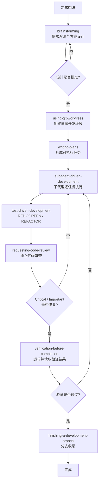
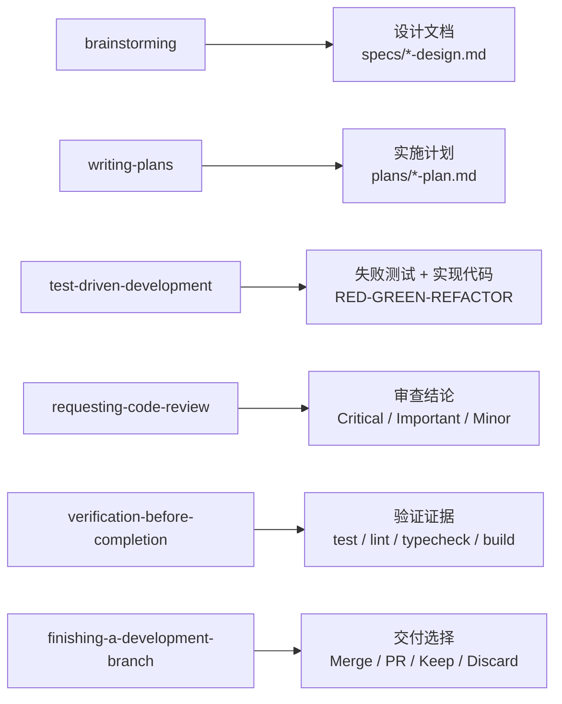
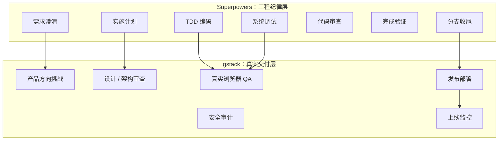
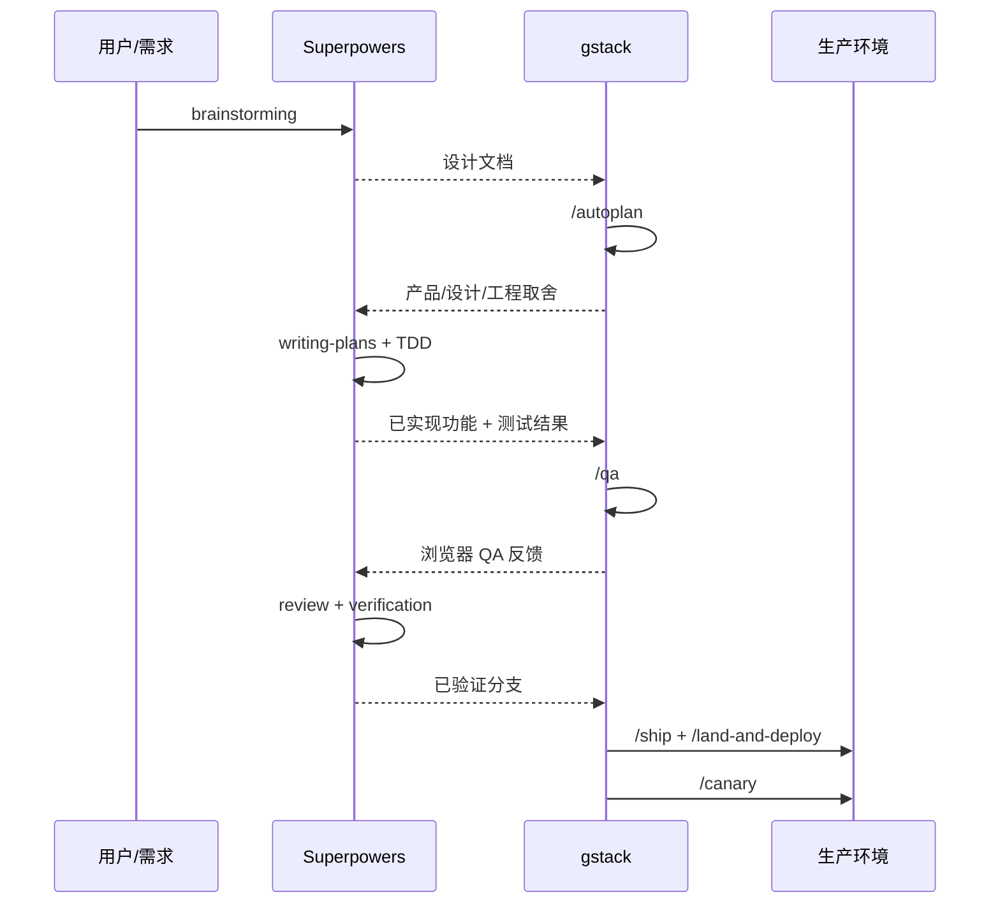

# Superpowers 项目实战使用指南

> [!summary] 核心结论
> Superpowers 的核心价值不是让 AI 更会写代码，而是让 AI 按工程纪律写代码。
>
> 它解决的问题是：AI 生成的代码如何从“能跑”变成“可信、可审查、可验证、可交付”。

## 0. 阅读导航

> [!tip] 怎么读这篇
> - 想快速理解：先看 [[#5. 标准 7 阶段闭环]] 和 [[#20. 最终总结]]。
> - 想落地项目：重点看 [[#15. 在项目中怎么落地]] 和 [[#19. 项目实战提示词模板]]。
> - 想和 gstack 搭配：直接看 [[#16. 和 gstack 的配合边界]]。

| 你想解决的问题 | 推荐阅读 |
| --- | --- |
| AI 写代码不稳定 | [[#2. Superpowers 的核心哲学]] |
| 不知道什么时候用哪个 Skill | [[#4. 14 个 Skills 的分工]] |
| 想建立项目流程 | [[#5. 标准 7 阶段闭环]] |
| 想规范 TDD | [[#10. 阶段五：Test-driven Development]] |
| 想规范 Debug | [[#11. 阶段六：Systematic Debugging]] |
| 想写 CLAUDE.md | [[#17. CLAUDE.md 配置模板]] |

## 0.1 一页速览

| 模块 | 关键词 | 项目作用 |
| --- | --- | --- |
| 需求 | `brainstorming` | 先澄清需求，再进入实现 |
| 计划 | `writing-plans` | 把功能拆成可执行任务 |
| 环境 | `using-git-worktrees` | 隔离实验场，保护主分支 |
| 编码 | `test-driven-development` | 先失败测试，再生产代码 |
| 调试 | `systematic-debugging` | 先找根因，再修 bug |
| 审查 | `requesting-code-review` | 独立 reviewer 发现风险 |
| 验证 | `verification-before-completion` | 没有证据，不说完成 |
| 收尾 | `finishing-a-development-branch` | 合并、PR、保留或丢弃 |

> [!check] 最小实践闭环
> `brainstorming` → `writing-plans` → `test-driven-development` → `requesting-code-review` → `verification-before-completion` → `finishing-a-development-branch`

## 1. Superpowers 是什么

Superpowers 是一套面向 AI 编程 Agent 的工程方法论框架。

它不是普通插件功能集合，而是一组强制执行的 Skills。每个 Skill 都定义了一种工程行为，例如：

- 写代码前必须先做需求澄清。
- 设计没有被批准前不能进入实现。
- 没有失败测试不能写生产代码。
- 遇到 bug 不能凭感觉修，必须先定位根因。
- 每个任务完成后必须做代码审查。
- 声明完成前必须运行验证并读取结果。

可以把 Superpowers 理解为：

> [!quote] 定位
> AI 编程过程中的工程纪律层。

它关注的不是“做什么产品”，而是“怎样把代码写得可靠”。

## 2. Superpowers 的核心哲学

Superpowers 的核心哲学可以概括为三句话：

1. AI 不是用来随手生成代码的，而是用来执行严格工程标准的。
2. Skills 不是散文式建议，而是塑造 Agent 行为的精确指令。
3. 没有设计、测试、审查和验证的代码，不应该被认为是完成的代码。

在项目实践中，这意味着：

- 不要直接让 AI “帮我实现某功能”。
- 先让 AI 澄清需求、提出方案、等待确认。
- 再让 AI 写计划、拆任务、按 TDD 执行。
- 每个任务结束后都要审查。
- 最后必须完整验证。

> [!warning] 最容易踩的坑
> 直接让 AI “实现功能”通常会跳过设计、测试和审查。Superpowers 的价值就是把这些步骤变成强制流程，而不是靠开发者临时想起来。

## 3. Superpowers 的能力边界

Superpowers 主要负责工程质量流程。

适合它处理的事情：

- 需求澄清
- 技术设计
- 实施计划
- Git worktree 隔离开发
- TDD 红绿循环
- 系统化调试
- 子代理任务执行
- 代码审查
- 完成前验证
- 分支收尾

不适合完全交给它处理的事情：

- 产品方向判断
- 商业优先级判断
- 真实浏览器端到端 QA
- 发布流水线
- 部署上线
- 上线后监控

这些外部世界和产品交付相关的环节，可以交给 gstack 等工具补充。

> [!info] 和 gstack 的一句话边界
> Superpowers 负责让代码可靠；gstack 负责让功能在真实世界可用并上线。

## 4. 14 个 Skills 的分工

Superpowers 的 Skills 可以分成四类。

### 4.1 需求与计划类

| Skill | 作用 |
| --- | --- |
| `brainstorming` | 写代码前澄清需求、提出方案、等待用户批准 |
| `writing-plans` | 将设计拆成可执行的实施计划 |
| `executing-plans` | 按计划逐步执行任务 |

### 4.2 开发协作类

| Skill | 作用 |
| --- | --- |
| `using-git-worktrees` | 创建隔离开发环境，避免污染主分支 |
| `subagent-driven-development` | 将任务交给独立子代理执行 |
| `dispatching-parallel-agents` | 在适合的场景下并行派发子任务 |

### 4.3 质量保障类

| Skill | 作用 |
| --- | --- |
| `test-driven-development` | 强制 RED-GREEN-REFACTOR TDD 流程 |
| `systematic-debugging` | 按根因分析流程调试问题 |
| `requesting-code-review` | 请求独立代码审查 |
| `receiving-code-review` | 处理审查反馈并修复问题 |
| `verification-before-completion` | 声明完成前必须验证 |

### 4.4 收尾与元技能类

| Skill | 作用 |
| --- | --- |
| `finishing-a-development-branch` | 分支收尾、验证、合并或 PR |
| `writing-skills` | 编写自定义 Skills |
| `using-superpowers` | Superpowers 入门与使用规则 |

## 5. 标准 7 阶段闭环

Superpowers 推荐的完整开发闭环如下：



```text
需求想法
  ↓
brainstorming
  ↓
using-git-worktrees
  ↓
writing-plans
  ↓
subagent-driven-development
  ↓
test-driven-development
  ↓
requesting-code-review
  ↓
verification-before-completion
  ↓
finishing-a-development-branch
  ↓
完成
```

这个流程的重点是：

- 先想清楚，再写代码。
- 先写测试，再写实现。
- 先审查，再继续推进。
- 先验证，再宣称完成。

### 5.1 阶段产物总览



## 6. 阶段一：Brainstorming

### 6.1 什么时候使用

当你有一个需求想法，但还没完全想清楚时，先使用 `brainstorming`。

例如：

```text
我想实现一个优惠券核销 API，先不要写代码，请先帮我澄清需求和设计方案。
```

### 6.2 它应该帮你问什么

以优惠券核销 API 为例，Agent 应该问：

- 优惠券有哪些类型？
- 一张券能使用几次？
- 是否有过期时间？
- 已使用的券再次核销时返回什么错误？
- 并发核销同一张券时，期望行为是什么？
- 核销失败后状态如何处理？
- 是否需要记录核销日志？
- API 的调用方是谁？
- 是否需要权限校验？

### 6.3 输出什么

`brainstorming` 阶段应该输出设计文档，包含：

- 背景
- 目标
- 非目标
- 核心流程
- 状态转换
- 边界条件
- 错误处理
- 并发策略
- 验收标准

建议文档路径：

```text
docs/superpowers/specs/YYYY-MM-DD-<topic>-design.md
```

### 6.4 项目规则

设计没被批准前，不允许写代码。

这是 Superpowers 的硬门禁之一。

## 7. 阶段二：Git Worktrees

### 7.1 为什么使用 worktree

AI 编程经常会改多个文件。如果直接在主分支开发，一旦方向错了，回滚成本很高。

使用 `using-git-worktrees` 可以：

- 隔离开发环境
- 保持主工作区干净
- 支持多个功能并行开发
- 降低回滚成本
- 避免 AI 污染主分支

### 7.2 推荐目录

```text
.worktrees/<feature-name>
```

例如：

```text
.worktrees/coupon-redeem
.worktrees/user-analytics-dashboard
.worktrees/billing-refactor
```

### 7.3 推荐配置

在 `.gitignore` 中加入：

```gitignore
.worktrees/
worktrees/
```

### 7.4 常见命令

```bash
git worktree add .worktrees/coupon-redeem feature/coupon-redeem
cd .worktrees/coupon-redeem
npm install
npm test
```

基线测试必须先通过，才能开始开发。

## 8. 阶段三：Writing Plans

### 8.1 什么时候使用

设计方案确认后，使用 `writing-plans` 把设计拆成可执行任务。

提示词示例：

```text
基于已经批准的设计文档，使用 writing-plans 拆解实施计划。每个任务控制在 2-5 分钟粒度，必须包含测试、实现、验证和提交步骤。
```

### 8.2 好计划应该长什么样

不好的计划：

```text
1. 实现优惠券 API
2. 增加测试
3. 处理异常
```

好的计划：

```text
Task 1: 定义 CouponRedeemRequest DTO

Step 1: 写 DTO 校验测试，验证 couponId、orderId、userId 必填。
Step 2: 运行测试，确认失败。
Step 3: 实现 CouponRedeemRequest DTO。
Step 4: 运行测试，确认通过。
Step 5: 提交变更。

Task 2: 实现过期券校验

Step 1: 写测试，验证过期券不能核销。
Step 2: 运行测试，确认失败。
Step 3: 在 validateCoupon() 中增加 expiresAt 校验。
Step 4: 运行测试，确认通过。
Step 5: 提交变更。
```

### 8.3 计划中的禁忌

计划里不要出现：

- TODO
- TBD
- 稍后实现
- 参考上一步
- 增加适当错误处理
- 实现相关逻辑
- 根据需要补充测试

原因是：子代理可能没有完整上下文。模糊计划会导致不可预测的实现。

### 8.4 输出什么

建议文档路径：

```text
docs/superpowers/plans/YYYY-MM-DD-<topic>-plan.md
```

## 9. 阶段四：Subagent-driven Development

### 9.1 什么时候使用

当计划已经拆好，可以使用 `subagent-driven-development` 逐任务执行。

每个任务派一个新的 subagent。

这样做的好处：

- 子代理上下文干净
- 任务边界清晰
- 主 Agent 负责协调
- 实现者和审查者可以分离
- 降低上下文污染风险

### 9.2 适合交给 subagent 的任务

- 定义 DTO
- 实现单个 service 方法
- 实现单个 API endpoint
- 实现单个页面组件
- 增加单个测试文件
- 修复一个明确 bug
- 增加一个数据库迁移

### 9.3 不适合直接交给 subagent 的任务

- 模糊需求
- 大型架构决策
- 整个系统重构
- 没有验收标准的功能
- 需要大量产品判断的任务

### 9.4 执行规则

每个 subagent 必须：

1. 读取当前任务说明。
2. 按 TDD 执行。
3. 运行验证命令。
4. 汇报结果。
5. 不随意修改任务范围之外的文件。

## 10. 阶段五：Test-driven Development

### 10.1 核心铁律

`test-driven-development` 的核心铁律是：

> 没有失败测试，不准写生产代码。

如果先写了生产代码，再补测试，这不算 TDD。

### 10.2 标准流程

```text
RED
  写测试
  运行测试
  确认测试因预期断言失败

GREEN
  写最少生产代码
  运行测试
  确认测试通过

REFACTOR
  在测试保护下重构
  再运行测试
```

### 10.3 优惠券核销示例

需求：

```text
同一张优惠券并发核销时，只允许一个请求成功。
```

先写测试：

```ts
it('同一张券并发核销，只有一个成功', async () => {
  const coupon = await Coupon.create({
    id: 'cpn_001',
    status: 'ACTIVE',
    version: 0,
  });

  const [result1, result2] = await Promise.allSettled([
    CouponService.redeem({ couponId: 'cpn_001', orderId: 'ord_001' }),
    CouponService.redeem({ couponId: 'cpn_001', orderId: 'ord_002' }),
  ]);

  const successCount = [result1, result2].filter(
    result => result.status === 'fulfilled'
  ).length;

  expect(successCount).toBe(1);
});
```

确认测试失败后，再写实现：

```ts
const affected = await db.query(
  `UPDATE coupons
   SET status = 'USED', version = version + 1, used_at = NOW()
   WHERE id = ? AND status = 'ACTIVE' AND version = ?`,
  [req.couponId, currentVersion]
);

if (affected === 0) {
  throw new CouponAlreadyRedeemedError(req.couponId);
}
```

### 10.4 常见错误

错误做法：

- 先写实现，再补测试。
- 测试没有真的失败过。
- RED 阶段失败原因是编译错误，而不是断言失败。
- GREEN 阶段顺便加很多功能。
- REFACTOR 阶段引入新行为。

正确做法：

- 先写最小失败测试。
- 看见它按预期失败。
- 写最少代码让它通过。
- 重构时不改变行为。

## 11. 阶段六：Systematic Debugging

### 11.1 什么时候使用

遇到 bug 时使用 `systematic-debugging`。

不要直接说：

```text
修一下这个 bug。
```

推荐说：

```text
使用 systematic-debugging。先复现问题并定位根因，不要直接改代码。
```

### 11.2 四阶段流程

```text
Phase 1: Root Cause Investigation
Phase 2: Pattern Analysis
Phase 3: Hypothesis and Testing
Phase 4: Implementation
```

具体动作：

1. 阅读错误信息。
2. 复现问题。
3. 检查最近变更。
4. 收集证据。
5. 找正常路径对比。
6. 提出单一假设。
7. 写最小测试验证假设。
8. 修复根因。
9. 运行验证。

### 11.3 调试铁律

没有根因分析，不允许修复。

如果连续多次修复失败，不应该继续猜，而应该重新审视假设、设计或架构。

## 12. 阶段七：Code Review

### 12.1 什么时候使用

每个任务完成后，都应该使用 `requesting-code-review`。

尤其是：

- 完成一个计划任务后
- 完成一个功能模块后
- 合并主分支前
- 发布前

### 12.2 审查关注点

Superpowers 的代码审查重点是：

- 是否满足规格
- 是否遗漏边界条件
- 是否有测试缺口
- 是否有行为回归
- 是否有并发问题
- 是否有错误处理问题
- 是否有不必要的复杂度

### 12.3 审查结果分级

```text
Critical:
  必须立即修复，否则不能继续。

Important:
  继续前应该修复。

Minor:
  可以记录，稍后处理。
```

### 12.4 处理审查反馈

使用 `receiving-code-review` 处理反馈。

规则：

- Critical 必须修。
- Important 通常必须修。
- Minor 可以记录。
- 修复后重新审查。

不要忽略 Critical 或 Important 后继续推进。

## 13. 阶段八：Verification Before Completion

### 13.1 核心原则

`verification-before-completion` 的原则是：

> 没有验证，就不能宣称完成。

### 13.2 Gate Function

```text
IDENTIFY
  找到所有需要验证的东西

RUN
  执行验证命令

READ
  读取完整输出

VERIFY
  确认结果符合预期
```

跳过任何一步，都不算完成验证。

### 13.3 常见验证命令

Node.js 项目：

```bash
npm test
npm run lint
npm run typecheck
npm run build
```

Go 项目：

```bash
go test ./...
go vet ./...
```

Java 项目：

```bash
mvn test
```

Python 项目：

```bash
pytest
ruff check .
mypy .
```

### 13.4 完成报告应包含

- 运行了哪些命令
- 每个命令是否通过
- 关键输出摘要
- 未解决问题
- 风险说明
- 是否可以合并或发布

## 14. 阶段九：Finishing a Development Branch

### 14.1 什么时候使用

当所有任务完成、审查通过、验证通过后，使用 `finishing-a-development-branch`。

### 14.2 它负责什么

- 运行最终测试
- 检查工作区状态
- 确认分支变更
- 提供合并选项
- 清理 worktree
- 回到主工作区

### 14.3 常见选项

```text
Merge
  直接合并到主分支

PR
  创建 Pull Request

Keep
  保留分支，暂不合并

Discard
  丢弃变更
```

## 15. 在项目中怎么落地

### 15.1 最小可执行流程

如果不想一开始使用完整闭环，可以先落地这 6 步：

```text
1. brainstorming
2. writing-plans
3. test-driven-development
4. requesting-code-review
5. verification-before-completion
6. finishing-a-development-branch
```

这已经能覆盖大部分 AI 编程风险：

- 需求没想清楚
- 计划不可执行
- 没有测试
- 没有审查
- 没有验证
- 分支收尾混乱

### 15.2 后端功能推荐流程

适合：

- API
- 服务逻辑
- 状态机
- 支付回调
- 权限系统
- 数据同步

流程：

```text
brainstorming
  ↓
writing-plans
  ↓
using-git-worktrees
  ↓
subagent-driven-development
  ↓
test-driven-development
  ↓
systematic-debugging
  ↓
requesting-code-review
  ↓
verification-before-completion
  ↓
finishing-a-development-branch
```

重点：

- 并发测试
- 错误处理
- 状态转换
- 数据一致性
- 回归测试

### 15.3 前端功能推荐流程

适合：

- 后台页面
- 表单流程
- 数据表格
- 图表看板
- 设置页

流程：

```text
brainstorming
  ↓
writing-plans
  ↓
using-git-worktrees
  ↓
test-driven-development
  ↓
requesting-code-review
  ↓
verification-before-completion
```

前端真实浏览器验证建议交给 gstack 的 `/qa` 或 `/browse` 补充。

### 15.4 Bug 修复推荐流程

```text
systematic-debugging
  ↓
写失败回归测试
  ↓
test-driven-development
  ↓
requesting-code-review
  ↓
verification-before-completion
```

重点：

- 先复现
- 找根因
- 写回归测试
- 修最小代码
- 验证不回归

### 15.5 安全敏感功能推荐流程

适合：

- 登录
- 权限
- 支付
- Webhook
- 多租户
- 文件上传
- API Key

流程：

```text
brainstorming
  ↓
writing-plans
  ↓
test-driven-development
  ↓
requesting-code-review
  ↓
verification-before-completion
```

安全审计建议额外接入 gstack `/cso`。

## 16. 和 gstack 的配合边界

Superpowers 和 gstack 最适合的关系是接力，而不是互相替代。



### 16.1 Superpowers 负责

```text
需求澄清
实施计划
TDD
系统调试
代码审查
完成验证
分支收尾
```

### 16.2 gstack 负责

```text
产品方向挑战
设计审查
真实浏览器 QA
安全审计
发布
部署
上线后监控
```

### 16.3 关键交接点



| Superpowers | gstack | 交接内容 |
| --- | --- | --- |
| `brainstorming` | `/autoplan` | 设计文档 |
| `writing-plans` | `/plan-eng-review` | 实施计划 |
| `test-driven-development` | `/qa` | 已通过的测试和功能实现 |
| `systematic-debugging` | `/investigate` | 根因假设与问题上下文 |
| `finishing-a-development-branch` | `/ship` | 已验证的分支 |

## 17. CLAUDE.md 配置模板

建议在项目根目录维护一份 `CLAUDE.md`，明确 Superpowers 的路由规则。

```md
# AI Development Workflow

## Superpowers

Superpowers 负责工程纪律和代码质量流程。

适用范围：

- brainstorming
- writing-plans
- using-git-worktrees
- subagent-driven-development
- test-driven-development
- systematic-debugging
- requesting-code-review
- receiving-code-review
- verification-before-completion
- finishing-a-development-branch

规则：

- 写代码前必须先完成需求澄清和设计。
- 没有失败测试，不允许写生产代码。
- 每个任务完成后必须进行代码审查。
- 声明完成前必须运行验证命令并读取结果。
- 不允许在主分支直接进行大规模开发。

## Routing

- 需求澄清 → Superpowers brainstorming
- 实施计划 → Superpowers writing-plans
- 隔离开发 → Superpowers using-git-worktrees
- 编码实现 → Superpowers test-driven-development
- 子任务执行 → Superpowers subagent-driven-development
- 系统调试 → Superpowers systematic-debugging
- 代码审查 → Superpowers requesting-code-review
- 审查反馈处理 → Superpowers receiving-code-review
- 完成前验证 → Superpowers verification-before-completion
- 分支收尾 → Superpowers finishing-a-development-branch

## Completion Rule

没有测试、lint、typecheck、build 或对应项目验证命令的明确输出，不允许声明任务完成。
```

## 18. 常见错误与正确做法

| 错误做法 | 后果 | 正确做法 |
| --- | --- | --- |
| 直接让 AI 写代码 | 需求偏差，返工成本高 | 先 `brainstorming` |
| 设计没确认就实现 | 做错方向 | 设计批准后再写计划 |
| 计划里写 TBD | 子代理输出不可控 | 每一步写具体动作 |
| 在主分支开发 | 污染工作区 | 使用 `using-git-worktrees` |
| 先写代码再补测试 | 测试可信度低 | 强制 TDD |
| 没复现就修 bug | 容易修错 | 使用 `systematic-debugging` |
| 跳过代码审查 | 风险进入主分支 | 每个任务后 review |
| 没跑验证就说完成 | 不可信 | 使用 `verification-before-completion` |
| 不清理分支 | 仓库混乱 | 使用 `finishing-a-development-branch` |

## 19. 项目实战提示词模板

### 19.1 启动需求澄清

```text
我想实现 <功能名称>。先不要写代码，请使用 Superpowers brainstorming 帮我澄清需求、边界条件、方案选择和验收标准。设计方案经过我确认后再进入计划阶段。
```

### 19.2 编写实施计划

```text
基于已确认的设计文档，请使用 Superpowers writing-plans 编写实施计划。每个任务控制在 2-5 分钟粒度，必须包含失败测试、实现步骤、验证命令和提交点。不要出现 TBD、TODO 或模糊描述。
```

### 19.3 执行计划

```text
请按照实施计划从 Task 1 开始执行。每个任务必须遵守 test-driven-development：先写失败测试，确认失败后，再写最小生产代码让测试通过。任务完成后请求代码审查。
```

### 19.4 调试问题

```text
请使用 Superpowers systematic-debugging 调查这个问题。先复现并定位根因，不要直接修改代码。提出假设后，用最小测试验证，再进行修复。
```

### 19.5 完成前验证

```text
请使用 Superpowers verification-before-completion。识别需要验证的内容，运行完整验证命令，读取输出，并明确说明是否通过。没有验证证据不要宣称完成。
```

### 19.6 分支收尾

```text
请使用 Superpowers finishing-a-development-branch 完成当前分支收尾。先运行最终验证，再给出 merge、PR、keep、discard 选项。
```

## 20. 最终总结

Superpowers 的项目使用方法可以浓缩为一条纪律链：


```text
先澄清
再计划
隔离开发
先测后写
系统调试
独立审查
完成前验证
最后收尾
```

它的价值不在于让 AI 产出更多代码，而在于让 AI 产出的代码更可靠。

一句话总结：

> Superpowers 负责把 AI 编程从“聊天式生成代码”变成“纪律化工程交付”。
