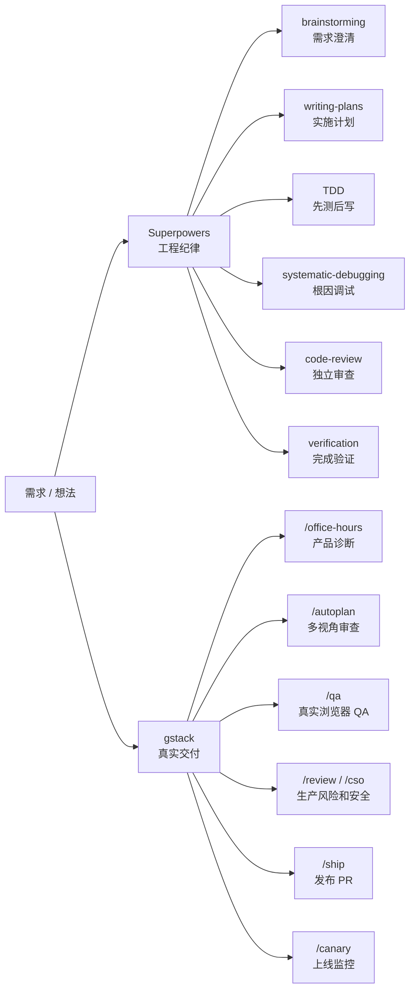
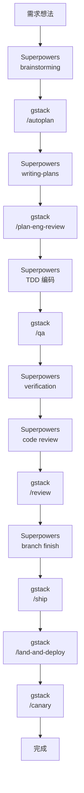

# AI Agent 工作流总览

> [!summary] 一句话
> Superpowers 负责工程纪律，gstack 负责真实交付。一个保证代码可信，一个保证产品可用并能上线。

## 快速入口

| 文档 | 适合解决的问题 | 入口 |
| --- | --- | --- |
| Superpowers 项目实战使用指南 | 需求澄清、TDD、调试、审查、验证、分支收尾 | [[Superpowers]] |
| gstack 项目实战使用指南 | 产品诊断、浏览器 QA、安全审计、发布部署、上线监控 | [[gstack]] |

## 分工总览

## 标准闭环

## 场景速查

| 场景 | 推荐组合 |
| --- | --- |
| 后端 API | `brainstorming` → `writing-plans` → `TDD` → `code review` → `/ship` |
| 前端页面 | `brainstorming` → `/plan-design-review` → `TDD` → `/qa` → `/review` |
| Bug 修复 | `systematic-debugging` → `/investigate` → 回归测试 → `/qa` |
| 快速 MVP | `/office-hours` → `/autoplan` → `/qa` → `/ship` |
| 安全功能 | `brainstorming` → `/cso` → `TDD` → `/cso` → `/ship` |

> [!tip] 使用建议
> 如果你更重视稳定性，以 Superpowers 为主；如果你更重视快速产品验证，以 gstack 为主。两者真正的价值是边界清晰、按阶段接力。
