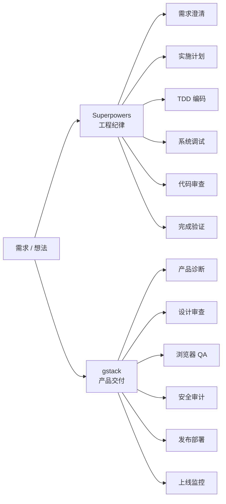
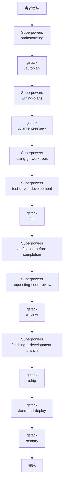
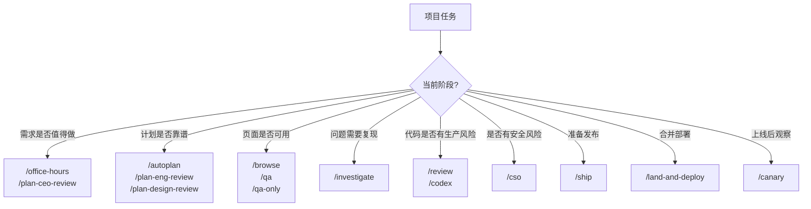
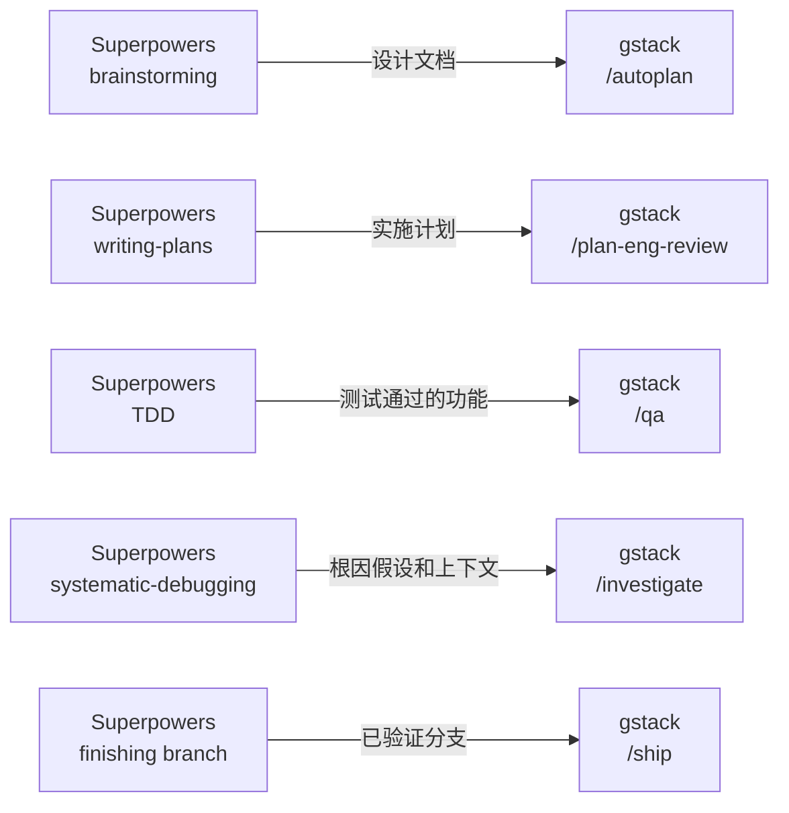

# gstack 项目实战使用指南

> [!summary] 核心结论
> gstack 的核心价值不是替 AI 写代码，而是给 AI 编程补上产品判断、真实浏览器验证、发布部署和上线监控能力。
>
> 如果说 Superpowers 负责“怎么把代码写可靠”，那么 gstack 负责“做什么、做成什么样、怎么上线”。

## 0. 阅读导航

> [!tip] 怎么读这篇
> - 想快速理解：先看 [[#3. gstack 和 Superpowers 的分工]] 和 [[#14. 最终总结]]。
> - 想知道命令怎么选：重点看 [[#4. gstack 常用命令分类]] 和 [[#5.1 gstack 命令路由图]]。
> - 想落地项目：直接看 [[#7. 项目中怎么使用 gstack]] 和 [[#12. 常用提示词模板]]。

| 你想解决的问题 | 推荐阅读 |
| --- | --- |
| 产品方向不确定 | [[#7.1 需求探索阶段]] |
| 计划需要多视角审查 | [[#7.2 计划审查阶段]] |
| 前端页面需要真实验证 | [[#7.3 前端开发验证阶段]] |
| Bug 需要浏览器证据 | [[#7.4 Bug 调查阶段]] |
| 发布前要找生产风险 | [[#7.5 代码审查阶段]] |
| 涉及权限、支付、安全 | [[#7.6 安全审计阶段]] |
| 准备上线 | [[#7.7 发布阶段]] |

## 0.1 一页速览

| 场景 | 命令 | 作用 |
| --- | --- | --- |
| 产品诊断 | `/office-hours` | 判断需求是否值得做 |
| 多视角审查 | `/autoplan` | CEO、设计、工程一起审 |
| 工程审查 | `/plan-eng-review` | 看架构、数据流、边界 |
| 设计审查 | `/plan-design-review` | 看体验、状态、交互 |
| 浏览器查看 | `/browse` | 打开真实页面观察 |
| 端到端 QA | `/qa` | 跑真实 Chromium 验证 |
| 只验证不修 | `/qa-only` | 输出问题和证据 |
| Bug 调查 | `/investigate` | 收集 Console、Network、DOM |
| 代码审查 | `/review` | Staff 工程师级审查 |
| 安全审计 | `/cso` | OWASP + STRIDE |
| 发布 | `/ship` | 测试、push、创建 PR |
| 部署监控 | `/land-and-deploy`、`/canary` | 合并部署和上线观察 |

> [!check] 最小实践闭环
> `/office-hours` → `/autoplan` → `/qa` → `/review` → `/ship`

## 1. gstack 是什么

gstack 是一套面向 Claude Code 的角色化 AI 技能集合。

它把常见产品开发流程拆成多个专家角色和斜杠命令，例如：

- `/office-hours`：像 YC 合伙人一样做产品诊断。
- `/plan-ceo-review`：从 CEO 视角挑战产品方向。
- `/plan-eng-review`：从工程视角审查架构和计划。
- `/plan-design-review`：从设计视角审查用户体验。
- `/browse`：打开真实浏览器观察页面。
- `/qa`：用真实 Chromium 跑端到端 QA。
- `/review`：做 Staff 工程师级代码审查。
- `/ship`：执行发布准备流程。
- `/land-and-deploy`：合并并部署。
- `/canary`：上线后监控控制台错误和性能回归。

可以把 gstack 理解为：

> [!quote] 定位
> AI 编程过程中的虚拟产品交付团队。

它关注的不是单纯写代码，而是：

- 这个功能值不值得做？
- 产品方向是否正确？
- 设计体验是否完整？
- 页面在真实浏览器里是否可用？
- 发布流程是否可靠？
- 上线后是否稳定？

## 2. gstack 的核心定位

gstack 的能力边界可以概括为一句话：

> gstack 负责外部世界：用户、浏览器、发布、部署、监控。

它适合处理：

- 产品方向判断
- 需求优先级挑战
- 多视角计划审查
- 设计审查
- 架构审查
- 浏览器操作
- 端到端 QA
- 安全审计
- 发布 PR
- 部署上线
- 上线后监控
- 发布文档

它不适合作为唯一工具处理：

- 严格 TDD 红绿循环
- 系统化根因调试
- 每个小任务的工程纪律约束
- 分支开发隔离
- 完成前验证门禁

这些更适合交给 Superpowers。

> [!info] 和 Superpowers 的一句话边界
> gstack 负责产品、浏览器、发布和上线；Superpowers 负责 TDD、调试、审查和完成验证。

## 3. gstack 和 Superpowers 的分工



| 维度 | Superpowers | gstack |
| --- | --- | --- |
| 核心定位 | 工程纪律框架 | 产品交付工具箱 |
| 关注点 | 怎么写好代码 | 做什么、做成什么样、怎么上线 |
| 触发方式 | 自动触发 Skills | 手动斜杠命令 |
| 典型能力 | TDD、调试、计划、审查、验证 | 产品诊断、浏览器 QA、发布、部署、监控 |
| 最适合阶段 | 编码过程 | 产品决策和真实交付 |

一句话：

```text
Superpowers 管代码质量。
gstack 管真实交付。
```

## 4. gstack 常用命令分类

### 4.1 产品方向类

| 命令 | 用途 |
| --- | --- |
| `/office-hours` | 产品诊断，挑战需求是否值得做 |
| `/plan-ceo-review` | CEO 视角审查产品方向和优先级 |
| `/autoplan` | 自动运行 CEO、设计、工程多视角计划审查 |

适合在需求早期使用。

例如：

```text
/office-hours
```

适合让 AI 追问：

- 这个需求服务谁？
- 为什么现在要做？
- 它解决的核心痛点是什么？
- 有没有更小的 MVP？
- 哪些功能应该砍掉？

### 4.2 计划与架构审查类

| 命令 | 用途 |
| --- | --- |
| `/plan-eng-review` | 工程视角审查架构、数据流、边界条件 |
| `/plan-design-review` | 设计视角审查交互、状态和体验 |
| `/autoplan` | 多角色自动审查计划 |

适合在 Superpowers 写完实施计划后使用。

重点检查：

- 架构是否合理
- 数据流是否清晰
- 状态转换是否完整
- 失败模式是否覆盖
- 权限边界是否明确
- 测试矩阵是否足够
- 前端状态是否完整

### 4.3 浏览器与 QA 类

| 命令 | 用途 |
| --- | --- |
| `/browse` | 打开真实浏览器观察页面、交互和控制台 |
| `/qa` | 自动执行真实浏览器 QA，并尝试修复问题 |
| `/qa-only` | 只做 QA，不自动修改 |
| `/investigate` | 用真实浏览器调查问题 |
| `/setup-browser-cookies` | 设置浏览器登录态或 Cookie |

适合前端功能、后台页面、图表、表单、登录流程等。

### 4.4 代码审查类

| 命令 | 用途 |
| --- | --- |
| `/review` | Staff 工程师级代码审查 |
| `/codex` | 跨模型第二意见审查 |

适合在基础代码审查之后使用，重点找：

- CI 能过但生产可能出问题的 bug
- 架构风险
- 状态管理问题
- 发布风险
- 性能隐患
- 可维护性问题

### 4.5 安全审计类

| 命令 | 用途 |
| --- | --- |
| `/cso` | 安全负责人视角审计，覆盖 OWASP Top 10 和 STRIDE |

适合：

- 登录注册
- 权限系统
- 支付
- Webhook
- 文件上传
- 多租户隔离
- 用户数据
- API Key
- 管理后台

### 4.6 发布与上线类

| 命令 | 用途 |
| --- | --- |
| `/ship` | 测试、覆盖率、push、创建 PR |
| `/land-and-deploy` | 合并、等待 CI、部署、验证生产环境 |
| `/canary` | 上线后监控控制台错误和性能回归 |
| `/document-release` | 生成发布说明或发布文档 |

适合功能完成、测试通过、审查通过之后。

### 4.7 控制与辅助类

| 命令 | 用途 |
| --- | --- |
| `/freeze` | 限制编辑范围 |
| `/unfreeze` | 解除编辑范围限制 |
| `/guard` | 增加保护性约束 |
| `/careful` | 让 Agent 更谨慎地执行 |
| `/learn` | 沉淀项目经验 |
| `/retro` | 复盘 |
| `/gstack-upgrade` | 升级 gstack |

## 5. 标准开发闭环中的 gstack 位置

完整项目流程可以这样安排：



```text
需求想法
  ↓
Superpowers: brainstorming
  ↓
gstack: /autoplan
  ↓
Superpowers: writing-plans
  ↓
gstack: /plan-eng-review
  ↓
Superpowers: using-git-worktrees
  ↓
Superpowers: test-driven-development
  ↓
gstack: /qa
  ↓
Superpowers: verification-before-completion
  ↓
Superpowers: requesting-code-review
  ↓
gstack: /review
  ↓
Superpowers: finishing-a-development-branch
  ↓
gstack: /ship
  ↓
gstack: /land-and-deploy
  ↓
gstack: /canary
  ↓
完成
```

gstack 在这条链路里主要负责四类交付动作：

1. 产品和计划审查。
2. 真实浏览器 QA。
3. 发布和部署。
4. 上线后监控。

### 5.1 gstack 命令路由图



## 6. 五个关键交接点



### 6.1 `brainstorming` → `/autoplan`

Superpowers 先澄清需求并产出设计文档。

gstack 使用 `/autoplan` 从多视角挑战这份设计：

- CEO 视角：这个需求值不值得做？
- 设计视角：用户体验是否完整？
- 工程视角：架构和边界是否合理？

交接产物：

```text
docs/superpowers/specs/YYYY-MM-DD-<topic>-design.md
```

### 6.2 `writing-plans` → `/plan-eng-review`

Superpowers 写出可执行实施计划。

gstack 用 `/plan-eng-review` 审查：

- 架构
- 数据流
- 状态转换
- 失败模式
- 信任边界
- 测试矩阵

交接产物：

```text
docs/superpowers/plans/YYYY-MM-DD-<topic>-plan.md
```

### 6.3 `test-driven-development` → `/qa`

Superpowers 保证单元测试和集成测试正确。

gstack 用 `/qa` 验证真实浏览器中的用户流程。

它能发现 TDD 不容易覆盖的问题：

- 页面白屏
- 控制台错误
- 网络请求失败
- 表单不能提交
- 图表不渲染
- 移动端布局错乱
- loading、empty、error 状态缺失

### 6.4 `systematic-debugging` → `/investigate`

Superpowers 负责根因分析方法论。

gstack 用 `/investigate` 补充真实浏览器证据：

- DOM
- Console
- Network
- LocalStorage
- Cookie
- 截图
- 用户交互路径

适合前端 bug 和联调问题。

### 6.5 `finishing-a-development-branch` → `/ship`

Superpowers 确认分支代码已经完成并验证。

gstack 用 `/ship` 接手发布流程：

- 同步 main
- 运行测试
- 检查覆盖率
- push 分支
- 创建 PR

之后继续：

```text
/land-and-deploy
  ↓
/canary
```

## 7. 项目中怎么使用 gstack

### 7.1 需求探索阶段

适合命令：

```text
/office-hours
/plan-ceo-review
/autoplan
```

推荐提示词：

```text
我想做 <功能名称>。请用 /office-hours 从产品价值、目标用户、MVP 范围和优先级角度挑战这个需求。
```

适合产出：

- 用户是谁
- 解决什么问题
- 为什么现在做
- 最小 MVP 是什么
- 哪些功能不做
- 成功指标是什么

### 7.2 计划审查阶段

适合命令：

```text
/autoplan
/plan-eng-review
/plan-design-review
```

推荐提示词：

```text
请基于当前设计文档和实施计划运行 /autoplan，只暴露需要我做决定的产品、设计和工程取舍。
```

如果只看架构：

```text
/plan-eng-review
```

如果只看体验：

```text
/plan-design-review
```

### 7.3 前端开发验证阶段

适合命令：

```text
/browse
/qa
/qa-only
/design-review
```

推荐提示词：

```text
请运行 /qa，打开本地开发服务器，完整走一遍用户流程。检查控制台错误、网络请求、页面状态、响应式布局和核心交互。
```

如果只想观察页面，不自动修：

```text
/qa-only
```

或：

```text
/browse
```

前端 QA 应覆盖：

- 页面能否打开
- 登录态是否正常
- 数据是否加载
- 表单是否可提交
- 图表是否渲染
- 表格是否可分页和筛选
- 空状态是否存在
- 加载状态是否存在
- 错误状态是否存在
- 移动端是否正常
- 控制台是否报错

### 7.4 Bug 调查阶段

适合命令：

```text
/investigate
/browse
/qa
```

推荐提示词：

```text
请使用 /investigate 在真实浏览器中复现这个问题。收集 Console、Network、DOM 和截图证据，先不要直接修改代码。
```

适合问题：

- 页面白屏
- 请求 401、403、500
- 按钮无响应
- 表单提交失败
- 图表不显示
- 登录态失效
- 样式错乱
- 生产环境复现但本地不复现

### 7.5 代码审查阶段

适合命令：

```text
/review
/codex
```

推荐提示词：

```text
请运行 /review，对当前分支做 Staff 工程师级审查。重点关注生产风险、架构问题、状态管理、性能隐患和测试缺口。
```

如果想要第二意见：

```text
/codex
```

### 7.6 安全审计阶段

适合命令：

```text
/cso
```

推荐提示词：

```text
请运行 /cso，对当前功能做安全审计。重点检查权限绕过、越权访问、输入校验、敏感信息泄露、日志泄密和 OWASP Top 10 风险。
```

安全敏感功能建议至少跑两次：

1. 设计阶段跑一次。
2. 发布前跑一次。

### 7.7 发布阶段

适合命令：

```text
/ship
/land-and-deploy
/canary
/document-release
```

推荐顺序：

```text
/ship
  ↓
/land-and-deploy
  ↓
/canary
  ↓
/document-release
```

`/ship` 适合做：

- 测试
- 覆盖率检查
- push
- 创建 PR

`/land-and-deploy` 适合做：

- 合并 PR
- 等待 CI
- 等待部署
- 验证生产环境

`/canary` 适合做：

- 检查线上控制台错误
- 检查性能回归
- 检查核心页面是否正常

## 8. 不同项目场景推荐组合

### 8.1 前端功能开发

适合：

- 后台页面
- 表单
- 图表
- 数据表格
- 设置页

推荐：

```text
Superpowers brainstorming
  ↓
gstack /plan-design-review
  ↓
Superpowers writing-plans
  ↓
Superpowers test-driven-development
  ↓
gstack /browse
  ↓
gstack /qa
  ↓
gstack /review
  ↓
gstack /ship
```

### 8.2 后端 API 开发

适合：

- API endpoint
- 状态机
- 业务服务
- 数据同步

推荐：

```text
Superpowers brainstorming
  ↓
Superpowers writing-plans
  ↓
Superpowers test-driven-development
  ↓
Superpowers requesting-code-review
  ↓
gstack /review
  ↓
gstack /ship
```

如果涉及安全或权限：

```text
gstack /cso
```

### 8.3 快速 MVP

适合：

- 创业项目
- 概念验证
- 个人产品
- 快速试错

推荐：

```text
gstack /office-hours
  ↓
gstack /autoplan
  ↓
编码实现
  ↓
gstack /qa
  ↓
gstack /ship
```

如果 MVP 变复杂，再引入 Superpowers 的 TDD 和代码审查。

### 8.4 Bug 修复

推荐：

```text
Superpowers systematic-debugging
  ↓
gstack /investigate
  ↓
修复根因
  ↓
gstack /qa
  ↓
gstack /review
```

### 8.5 安全敏感功能

适合：

- 登录
- 权限
- 支付
- Webhook
- 多租户
- 文件上传
- 用户数据

推荐：

```text
gstack /cso
  ↓
Superpowers writing-plans
  ↓
Superpowers test-driven-development
  ↓
gstack /cso
  ↓
gstack /ship
```

## 9. CLAUDE.md 配置模板

建议在项目根目录维护 `CLAUDE.md`，明确 gstack 的职责和路由规则。

```md
# gstack Workflow

## gstack

gstack 负责产品判断、真实浏览器验证、设计审查、安全审计、发布、部署和上线监控。

触发方式：斜杠命令手动触发。

适用范围：

- /office-hours
- /plan-ceo-review
- /plan-eng-review
- /plan-design-review
- /design-consultation
- /design-shotgun
- /design-html
- /review
- /ship
- /land-and-deploy
- /canary
- /benchmark
- /browse
- /qa
- /qa-only
- /design-review
- /setup-browser-cookies
- /setup-deploy
- /retro
- /investigate
- /document-release
- /codex
- /cso
- /autoplan
- /pair-agent
- /careful
- /freeze
- /guard
- /unfreeze
- /gstack-upgrade
- /learn

## Routing

- 产品方向诊断 → /office-hours
- CEO 视角审查 → /plan-ceo-review
- 多视角计划审查 → /autoplan
- 工程架构审查 → /plan-eng-review
- 设计审查 → /plan-design-review 或 /design-review
- 浏览器查看 → /browse
- 端到端 QA → /qa
- 只验证不修改 → /qa-only
- Bug 调查 → /investigate
- Staff 级代码审查 → /review
- 第二意见 → /codex
- 安全审计 → /cso
- 发布 → /ship
- 合并部署 → /land-and-deploy
- 上线监控 → /canary
- 发布文档 → /document-release

## Browser Rule

使用 /browse 作为浏览器入口。

## Release Rule

发布前必须完成测试、审查、QA 和必要的安全检查。
上线后必须运行 /canary 验证核心页面和控制台错误。
```

## 10. 安装与命名空间建议

### 10.1 安装

```bash
git clone --single-branch --depth 1 https://github.com/garrytan/gstack.git ~/.claude/skills/gstack
cd ~/.claude/skills/gstack
./setup
```

### 10.2 前缀模式

如果担心命令冲突，建议使用前缀模式：

```bash
cd ~/.claude/skills/gstack
./setup --prefix
```

这样命令会变成：

```text
/gstack-qa
/gstack-review
/gstack-ship
```

适合同时安装多个 Claude Code 插件的项目。

## 11. 常见错误与正确做法

| 错误做法 | 后果 | 正确做法 |
| --- | --- | --- |
| 只用 gstack 写代码，不做工程纪律 | 代码质量不可控 | 编码阶段配合 Superpowers |
| 跳过 `/office-hours` 直接做 MVP | 可能做错方向 | 早期先做产品诊断 |
| 只跑单元测试，不跑 `/qa` | 页面真实体验可能坏 | 前端功能必须浏览器验证 |
| `/qa` 发现问题后不加回归测试 | 问题容易复发 | 修复后补测试 |
| 发布前不跑 `/review` | 生产风险进入主分支 | 发布前做 Staff 级审查 |
| 安全敏感功能不跑 `/cso` | 越权和泄露风险 | 设计阶段和发布前都审计 |
| 上线后不跑 `/canary` | 线上问题发现晚 | 部署后立即监控 |
| 命令无前缀导致冲突 | 插件路由混乱 | 使用 `./setup --prefix` |

## 12. 常用提示词模板

### 12.1 产品诊断

```text
请使用 /office-hours 审查这个需求：<需求描述>。
重点从目标用户、痛点强度、MVP 范围、优先级和可以砍掉的功能角度挑战我。
```

### 12.2 多视角计划审查

```text
请运行 /autoplan，基于当前设计文档和实施计划，从 CEO、设计、工程三个视角审查。只把需要我做决策的取舍点暴露出来。
```

### 12.3 工程计划审查

```text
请运行 /plan-eng-review，检查当前实施计划的架构、数据流、状态转换、失败模式、信任边界和测试矩阵。
```

### 12.4 设计审查

```text
请运行 /plan-design-review，检查页面的信息架构、空状态、加载状态、错误状态、响应式布局、可访问性和交互反馈。
```

### 12.5 浏览器 QA

```text
请运行 /qa，打开本地开发服务器，完整走一遍核心用户流程。检查 Console、Network、DOM、截图、响应式布局、错误状态和空状态。
```

### 12.6 只验证不修改

```text
请运行 /qa-only，只做真实浏览器验证，不要修改代码。输出发现的问题、复现步骤和截图证据。
```

### 12.7 Bug 调查

```text
请运行 /investigate，在真实浏览器中复现问题。收集 Console、Network、DOM 和截图证据，先不要直接修复。
```

### 12.8 代码审查

```text
请运行 /review，对当前分支做 Staff 工程师级审查。重点关注生产风险、架构问题、状态管理、性能隐患、测试缺口和发布风险。
```

### 12.9 安全审计

```text
请运行 /cso，对当前功能做安全审计。重点检查权限绕过、越权访问、输入校验、敏感信息泄露、日志泄密、OWASP Top 10 和 STRIDE 风险。
```

### 12.10 发布

```text
请运行 /ship，完成发布准备：同步 main、运行测试、检查覆盖率、push 分支并创建 PR。
```

### 12.11 合并部署

```text
请运行 /land-and-deploy，等待 CI 通过，合并 PR，等待部署完成，并验证生产环境核心流程。
```

### 12.12 上线监控

```text
请运行 /canary，检查上线后的控制台错误、核心页面可用性、网络请求和性能回归。
```

## 13. 最小可执行 gstack 流程

如果只想快速落地 gstack，建议先用这 5 步：

```text
1. /office-hours
2. /autoplan
3. /qa
4. /review
5. /ship
```

这 5 步分别覆盖：

- 做不做
- 怎么做
- 能不能用
- 有没有生产风险
- 怎么发布

## 14. 最终总结

gstack 的项目使用方法可以浓缩为一条交付链：


```text
产品诊断
计划审查
浏览器 QA
代码审查
安全审计
发布部署
上线监控
```

它的价值不在于替代工程纪律，而在于把 AI 编程从“代码写完”推进到“产品真正可用并上线”。

一句话总结：

> gstack 负责把 AI 生成的功能带进真实世界：让它被用户看见、点得动、发得出去、上线后可监控。
